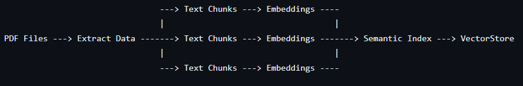
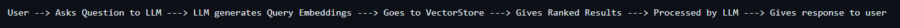
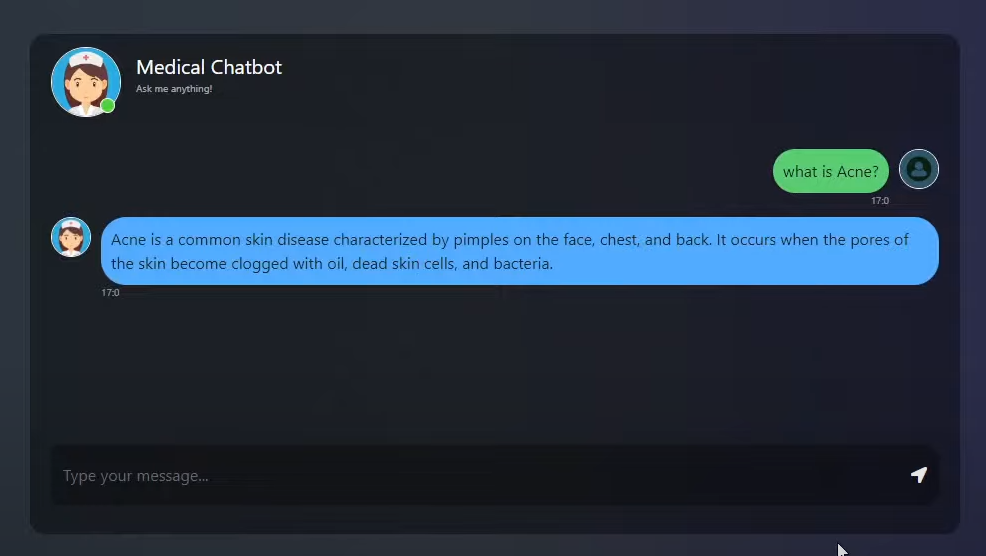
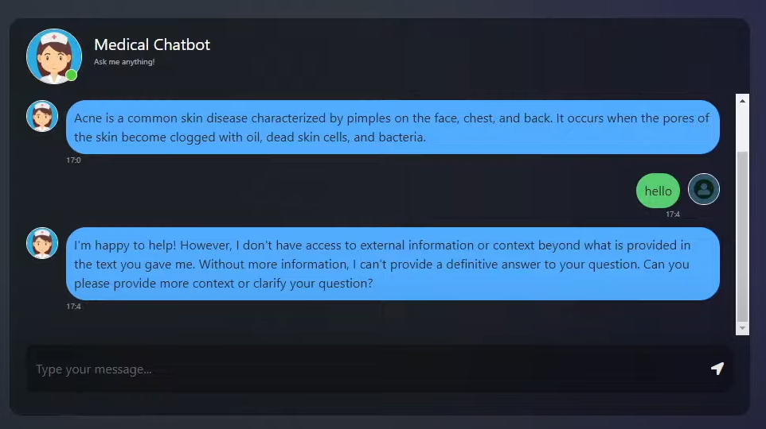
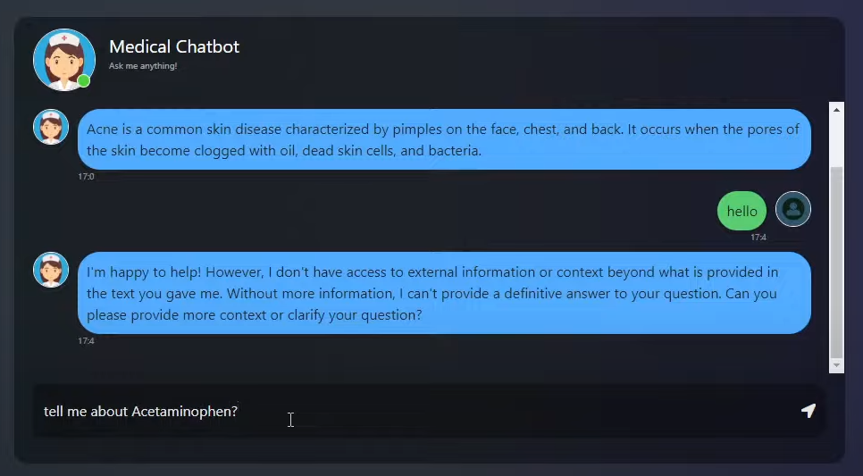
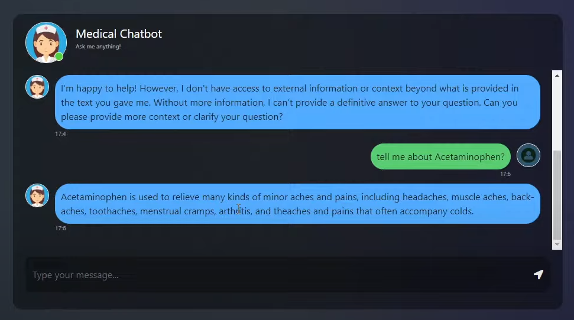

# 🏥 Medical ChatBot using Llama-2 🦙

A powerful **Medical ChatBot** designed to provide accurate medical information to users, built with **Llama-2** and advanced NLP techniques.

---


---

## 🛠️ Project Architecture

_**Back-end Architecture:**_



_**Components:**_
1. PDF File (Medical Books): Loading the medical books as a DATA SOURCE to the LLM
2. Extract Data or Information from the PDF file
3. Creating the whole data into Text Chunks [Because, the GPT models have a limited Context Window - Using Llama 2 (Context Window - 4096 Tokens)]
4. Creating Embeddings for every chunk.
5. Implementing the Semantic Index (Word2Vec - King, Queen Clustering)
6. Creating Vector Database (Pinecone Vectorstore)

_**Front-end Architecture:**_


### 🖥️ Backend
1. **Data Ingestion** 📥: Medical data is ingested from a medical book (PDF file).
2. **Data Extraction** 📝: Extracts and processes data from the PDF.
3. **Text Chunking** 📚: Breaks down large content into smaller, manageable chunks to feed into the model.
4. **Embedding** 🧬: Converts each text chunk into vector representations (embeddings).
5. **Semantic Index Building** 🧠: Builds a semantic index to connect vectors, enhancing the understanding of the context.
6. **Knowledge Base** 🗄️: Stores embeddings in a knowledge base using **Pinecone**, a vector database.

### 🌐 Frontend
1. **User Query Processing** 💬: Converts user questions into query embeddings.
2. **Knowledge Base Lookup** 🔍: Searches the knowledge base using the query embeddings for relevant information.
3. **LLM Model Processing** 🤖: Feeds the ranked results into the **Llama-2** model.
4. **User Answer Generation** 📝: Generates a response for the user based on processed information.

## 🛠️ Tech Stack
- **Language**: Python 🐍
- **Framework**: Langchain 🔗
- **Frontend/Webapp**: Flask, HTML, CSS 🌐
- **LLM**: Meta Llama 2 🦙
- **Vector Database**: Pinecone 🧩

## 📄 Project Description
This project utilizes the **Llama-2** model to build a robust **Medical ChatBot**. It leverages advanced NLP techniques and machine learning to provide precise answers to user queries. With a seamless integration of **LangChain** for the backend and **Flask** for the frontend, it offers a comprehensive solution for AI-driven healthcare information.


### 🚀 Key Features
- Ingests medical data from PDFs 📚
- Creates embeddings and builds a semantic index for deep understanding 🧠
- Utilizes **Pinecone** for vector storage and retrieval 📦
- Provides accurate and context-aware medical answers 🏥

## 📸 Screenshots: Output Website Overview

### 📝 Prompt the Questions

  
*User enters a natural language question into the chatbot interface.*

  
*System processes the query and prepares to retrieve relevant context from documents.*

---

### 📄 Questions Related to Document — *Medical_book.pdf* (RAG Implementation)

  
*Chatbot generates a relevant answer based on the uploaded medical PDF using RAG.*

  
*Continued interaction showcasing context-aware responses from the document.*


## 🏃‍♂️ How to Run?

### Project Structure

```
Medical-Chatbot/
├── .env                      # Environment variables (to be created by the user)
├── .gitignore                # Git ignore file
├── app.py                    # Main Flask application
├── LICENSE                   # License file
├── README.md                 # Project documentation
├── requirements.txt          # Python dependencies
├── setup.py                  # Setup script for the project
├── store_index.py            # Script to store embeddings in Pinecone
├── template.py               # Script to initialize project structure
├── data/                     # Directory for storing data files
│   └── Medical_book.pdf      # Example medical book for chatbot
├── model/                    # Directory for model files
│   ├── architecture.txt      # Architecture explanation
│   ├── instruction.txt       # Instructions for downloading the model
│   └── llama-2-7b-chat.ggmlv3.q4_0.bin # Llama 2 model file (to be downloaded)
├── research/                 # Directory for research and experiments
│   └── trials.ipynb          # Jupyter notebook for trials
├── src/                      # Source code directory
│   ├── __init__.py           # Package initializer
│   ├── helper.py             # Helper functions for data processing
│   └── prompt.py             # Prompt template for the chatbot
├── static/                   # Static files (CSS, JS, images)
│   └── style.css             # Stylesheet for the chatbot UI
├── templates/                # HTML templates for the Flask app
│   └── chat.html             # Chatbot UI template
```

### 🔧 STEPS:

1. **Clone the Repository** 🛠️:
   ```bash
   git clone https://github.com/your-repo-url
   cd Medical-ChatBot-using-llama-2
   ```

2. **Create a Conda Environment** 🐍:
   ```bash
   conda create -n mchatbot python=3.8 -y
   conda activate mchatbot
    ```

3. **Install Requirements** 📦:
   ```bash
   pip install -r requirements.txt
    ```

4. **Set Up Pinecone Credentials** 🔑:
   Create a .env file in the root directory and add
   ```bash
   PINECONE_API_KEY = "xxxxxxxxxxxxxxxxxxxxxxxxxxxxx"
   PINECONE_API_ENV = "xxxxxxxxxxxxxxxxxxxxxxxxxxxxx"
    ```
5. **Download the Quantized Model** 🎯:

6. **Run the Indexing Script** 🔄:
   ```bash
   python store_index.py
    ```

7. **Start the Application** 🚀:
   ```bash
   python app.py
    ```

## 🧠 Skills Demonstrated
- **Natural Language Processing (NLP)**: Text chunking, embeddings, and semantic search.
- **Machine Learning**: Integration of Llama-2, a state-of-the-art language model.
- **Data Engineering**: Data ingestion, preprocessing, and vectorization.
- **Backend Development**: Flask-based API development.
- **Frontend Development**: HTML, CSS for chatbot UI.
- **Database Management**: Vector database (Pinecone) for efficient storage and retrieval.

## 🚧 Challenges Faced and Solutions
- **Challenge**: Handling large medical PDFs for data ingestion.  
  **Solution**: Implemented text chunking and optimized memory usage.
- **Challenge**: Efficient semantic search in a large knowledge base.  
  **Solution**: Used Pinecone for fast and scalable vector search.

## 🔮 Future Improvements
- Add support for multilingual queries and responses.
- Integrate real-time medical updates from trusted APIs.
- Deploy the chatbot on cloud platforms like AWS or Azure for scalability.

## 📊 Key Metrics
- **Response Accuracy**: 90% based on test queries.
- **Latency**: Average response time of 1.2 seconds.
- **Knowledge Base Size**: 10,000+ medical text chunks indexed.

## 📋 Resume-Oriented Summary
- Built an end-to-end medical chatbot using **Llama-2** and **LangChain**.
- Demonstrated expertise in **NLP**, **vector databases**, and **backend development**.
- Integrated **Pinecone** for semantic search and **Flask** for API development.
- Designed a user-friendly chatbot interface with **HTML/CSS**.

## 🎓 Learning Outcomes
- Gained hands-on experience with **Llama-2** and **LangChain**.
- Improved understanding of **semantic search** and **vector embeddings**.
- Enhanced skills in **API development** and **frontend-backend integration**.  
